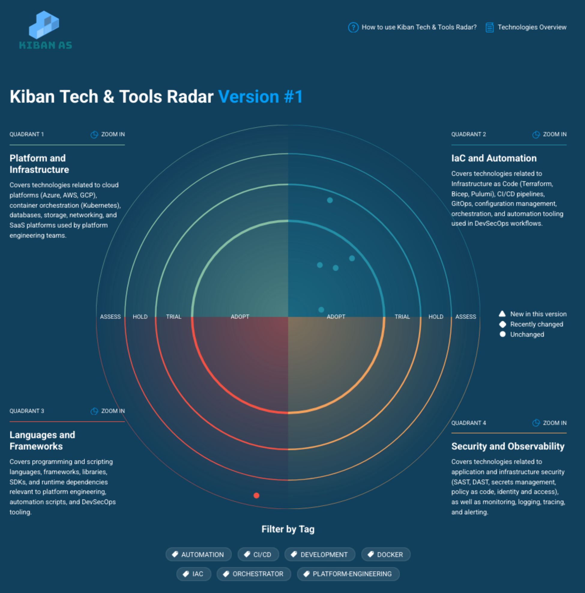

# Kiban Techradar




# Test the application locally
- Go to folder TechRadar in the repo.
- Create and make changes to `TechRadar/radar/<new-date>` folders with your changes
    - To simply modify the existing article you can click on the edit button on the tools history page and it will take you the the correct file in the project.
- On your shell, run the following commands inside TechRadar folder:
```shell
cd TechRadar
npm i
npm run build
docker build -t techradar . --progress=plain
docker run -it --rm -p 3000:80 techradar
```
- The url will now be available at: `http://localhost:3000/`
- Build and run the image every time you want to see your changes.

## Contributors

<a href="https://github.com/samiulsaki"></a>&nbsp;&nbsp;